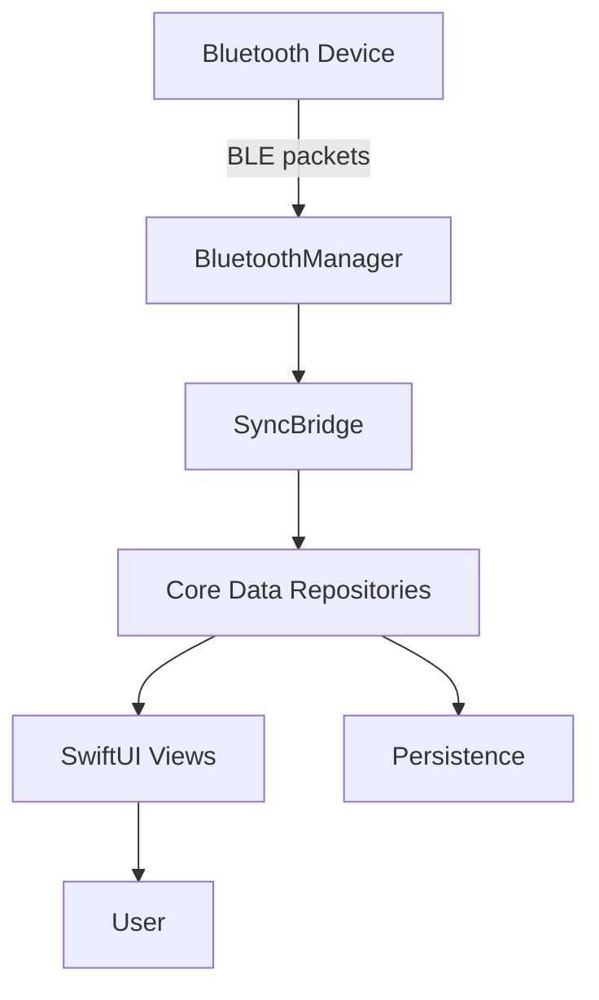

# VetraApp — Bluetooth-Enabled Session Tracking for iOS

Built by Adeesh Devanand.

A SwiftUI iOS application that connects to a Bluetooth device to parse and track inhalation sessions ("puffs"), organize them into phases, and persist session history locally with Core Data. Target audience: engineers and hiring managers evaluating iOS architecture, Bluetooth parsing, and data persistence.

---

## Demo / Screenshots

If you have screenshots, add them to `docs/` and reference below.




---

## Key Features

- Device discovery and data sync via Bluetooth (CoreBluetooth).
- Real-time parsing of BLE payloads into domain events (puffs, phases).
- Session history persisted locally using Core Data.
- SwiftUI interface: tracking, Bluetooth status, leaderboard, settings.
- MVVM-ish structure with `MainViewModel` coordinating app state.
- Basic views for progress planning and ripple effect visuals.

### Engineering Highlights

- Clear repository pattern for Core Data (`PhaseRepo`, `PuffRepo`, `SessionLifetimeRepo`).
- Robust Bluetooth parsing with unit, fuzz, and edge-case tests.
- Modular SwiftUI views with separation of concerns.
- `SyncBridge` mediates between BLE payloads and persistence models.
- Xcode scheme present for build/test automation via `xcodebuild`.

---

## How It Works

- App launch initializes SwiftUI entry point (`VetraApp.swift`).
- `ContentView`/`MainView` binds to `MainViewModel` for app state.
- `BluetoothManager` scans/connects and receives BLE payloads.
- `SyncBridge` transforms raw payloads into domain updates.
- Core Data repositories persist entities (`Puff`, `Phase`, `SessionLifetime`).
- Views render live state (tracker, leaderboard, Bluetooth status, settings).
- Data is stored locally; history is available offline.
- Tests validate Bluetooth parsing and bridge logic under edge cases.

### Architecture / Components

- `Bluetooth/` — `BluetoothManager.swift`, `SyncBridge.swift`: device interaction, data mediation.
- `CoreData/` — model, persistence, repos, and `VetraApp.xcdatamodeld`.
- `Models/` — `MainViewModel.swift` coordinating app state.
- `Views/` — SwiftUI views (Tracker, Leaderboard, Bluetooth, Settings, Main).
- `VetraApp/Info.plist`, `VetraApp.entitlements` — app configuration and permissions.
- `VetraAppTests/`, `VetraAppUITests/` — unit and UI test bundles.

Design choices and tradeoffs:
- Core Data chosen for local persistence; requires schema migration discipline.
- Repository pattern isolates Core Data from UI code for testability.
- SwiftUI simplifies UI composition; MVVM keeps state predictable.
- Bluetooth-driven design implies careful permission and lifecycle handling.

---

## Tech Stack

- Languages: Swift
- Frameworks: SwiftUI, CoreBluetooth, CoreData, XCTest
- Build: Xcode, `xcodebuild` (iOS target)
- Project: `VetraApp.xcodeproj`, scheme `VetraApp`

---

## Prerequisites

- macOS with Xcode (recommended: Xcode 15 or newer) and iOS 17+ Simulator.
- Apple Developer tools installed (`xcode-select --install`).
- Apple Developer account required for running on physical devices (code signing).
- Optional: Bluetooth device compatible with the app’s expected payload format (<PLACEHOLDER: Device model/spec>). 

Note: Building iOS apps is not supported on Linux/Windows; use macOS.

---

## Installation

### Clone the repository

```bash
git clone https://github.com/my-vetra/app-ios.git
cd app-ios
```

### Open in Xcode (recommended)

```bash
open VetraApp.xcodeproj
# Or
xed .
```

Select scheme `VetraApp`, choose an iOS Simulator (e.g., iPhone 15), and Run.

### Command-line builds (CI/local)

Debug build (simulator):

```bash
xcodebuild \
  -project VetraApp.xcodeproj \
  -scheme VetraApp \
  -sdk iphonesimulator \
  -configuration Debug \
  -destination 'platform=iOS Simulator,name=iPhone 15' \
  build
```

Release build (simulator):

```bash
xcodebuild \
  -project VetraApp.xcodeproj \
  -scheme VetraApp \
  -sdk iphonesimulator \
  -configuration Release \
  -destination 'platform=iOS Simulator,name=iPhone 15' \
  build
```

Device builds require proper signing settings in Xcode.

---

## Run / Usage

### Quickstart (Simulator)

```bash
open VetraApp.xcodeproj
# In Xcode: select iPhone 15 simulator, Run
```

### Typical App Flow (Happy Path)

- Launch the app.
- Grant Bluetooth permission if prompted.
- The app scans and connects to the device.
- Live session data (puffs/phases) updates UI; history persists in Core Data.

### CLI / API Examples

This project is an iOS app and does not expose a CLI or HTTP API. Test execution via `xcodebuild` is shown in Testing.

---

## Configuration

- `VetraApp/Info.plist` — app metadata and permissions (e.g., Bluetooth usage description).
- `VetraApp/VetraApp.entitlements` — app capabilities (entitlements for runtime features).
- Core Data model: `CoreData/VetraApp.xcdatamodeld` defines entities and relationships.

Environment variables and external config files are not used in this repo.

Required settings:
- Bluetooth permission strings in `Info.plist` (<PLACEHOLDER: confirm keys used>).
- Code signing settings for device deployment in Xcode.

Optional settings:
- Simulator selection and runtime options via Xcode.

---

## Testing

Unit tests and UI tests are present.

Run all tests on a simulator:

```bash
xcodebuild \
  -project VetraApp.xcodeproj \
  -scheme VetraApp \
  -destination 'platform=iOS Simulator,name=iPhone 15' \
  test
```

Test bundles:
- `VetraAppTests/` — Bluetooth parsing, SyncBridge edge cases, repositories.
- `VetraAppUITests/` — basic launch and UI flows.

Next improvements:
- Add test coverage reports.
- Add mock BLE payloads for deterministic UI tests.

---

## Troubleshooting

- Xcode not found: Install Xcode and run `xcode-select --install`.
- Simulator device missing: Add the device via Xcode → Settings → Platforms.
- Build errors about signing: Set a valid team or disable signing for simulator.
- BLE permission denied: Check Privacy settings and `Info.plist` usage descriptions.
- Core Data migration failures: Verify `VetraApp.xcdatamodeld` version and lightweight migration.
- Unknown scheme: Ensure `VetraApp.xcodeproj` and `VetraApp.xcscheme` are present and shared.
- `xcodebuild` destination errors: Use a valid simulator name/version (`xcrun simctl list`).
- UI tests fail on first run: Clean build folder and re-run after granting permissions.
- Build timeouts in CI: Use `-quiet` and specific destinations; pre-create simulators.
- Linking errors: Ensure SDK versions match the selected simulator runtime.

---

## Project Structure

```
VetraApp/
  VetraApp.swift                   # SwiftUI app entry
  Info.plist, VetraApp.entitlements
  Assets.xcassets/                 # App icons and assets
  Bluetooth/                       # BluetoothManager, SyncBridge
  CoreData/                        # Model, Persistence, Repos, Data Model
  Models/MainViewModel.swift       # App state
  Views/                           # SwiftUI views (Tracker, Bluetooth, Leaderboard, Settings)
VetraApp.xcodeproj/                # Xcode project and scheme
VetraAppTests/                     # Unit tests (Bluetooth parsing, repos, bridge)
VetraAppUITests/                   # UI tests (launch, flows)
```

---

## Security / Privacy

- No secrets committed; repo contains only app code and configuration.
- Local-only persistence via Core Data; no backend endpoints in this repo.
- Bluetooth permissions requested at runtime; user can revoke in Settings.
- Code signing and entitlements required for device deployment.
- Do not include regulated medical data; treat usage data responsibly.

---

## Roadmap

- Add GitHub Actions CI for build/test with `xcodebuild`.
- Expand unit tests for repos and Core Data migrations.
- Introduce mock BLE data sources for offline demos.
- Improve error handling and user feedback for BLE states.
- Add data export/import and migration strategies.
- Performance profiling for parsing and Core Data writes.
- Observability hooks (simple logging, metrics for dev builds).
- Documentation of BLE payload spec and integration guidance.

---

## License + Credits

- License: <PLACEHOLDER>
- Credit: Built by Adeesh Devanand.

---

## Missing Info (to finalize placeholders)

- Confirm minimum iOS and Xcode versions supported.
- Provide the Bluetooth device model/spec and characteristic format.
- Confirm `Info.plist` keys used for Bluetooth permissions.
- Clarify whether any backend or cloud services are planned/required.
- Share license (e.g., MIT/Apache-2.0) or company policy.
- Provide demo screenshots or decide to remove image placeholders.
- Specify supported simulators/devices for repeatable CI runs.
